# Fraud Detection Model Evaluation Report

## 1. Classification Metrics

| Model | PR-AUC | ROC-AUC | Optimal Threshold | Precision | Recall | F1 |
|-------|--------|---------|-------------------|-----------|--------|-----|
| Isolation Forest | 0.5381 | 0.9055 | 0.671 | 0.7368 | 0.5385 | 0.6222 |
| Autoencoder | 0.2566 | 0.8677 | 1.000 | 0.3611 | 0.5000 | 0.4194 |
| Ensemble | 0.5381 | 0.9055 | 0.671 | 0.7368 | 0.5385 | 0.6222 |

## 2. Cost-Benefit Analysis

Costs: FP = $50, FN = $500

| Model | Cost-Optimal Threshold | Cost at Optimal | Cost at Default (0.5) |
|-------|-------------------------|-----------------|------------------------|
| Isolation Forest | 0.55 | $5300 | $5700 |
| Autoencoder | 0.51 | $6600 | $6700 |
| Ensemble | 0.55 | $5300 | $5700 |

## 3. Visualizations

### Model comparison
- 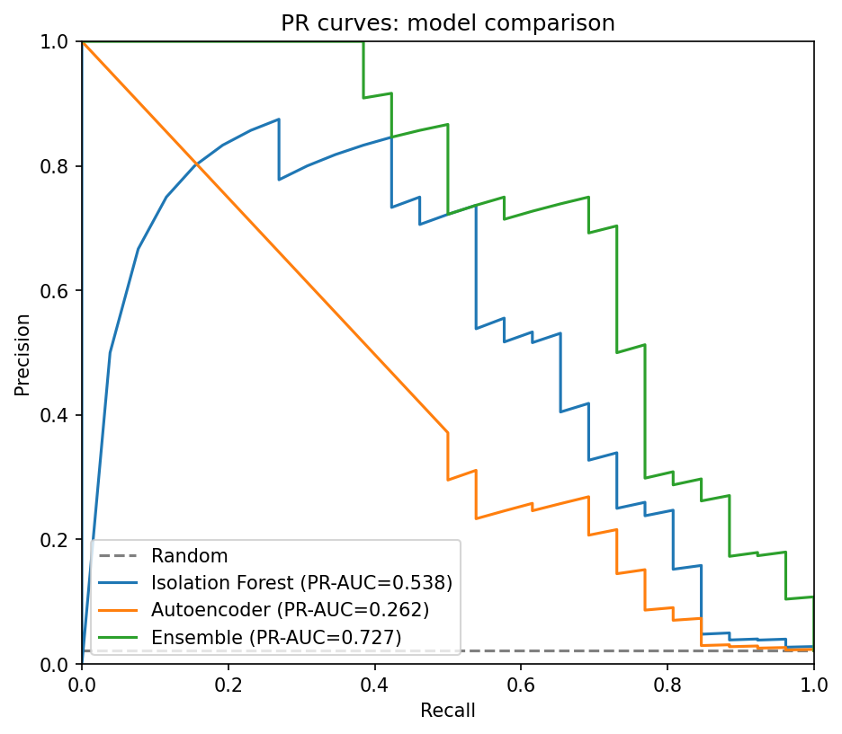

### Per-model plots

**Isolation Forest:**
- PR curve: 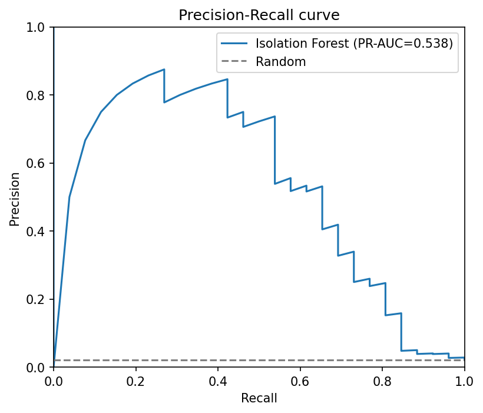
- ROC curve: 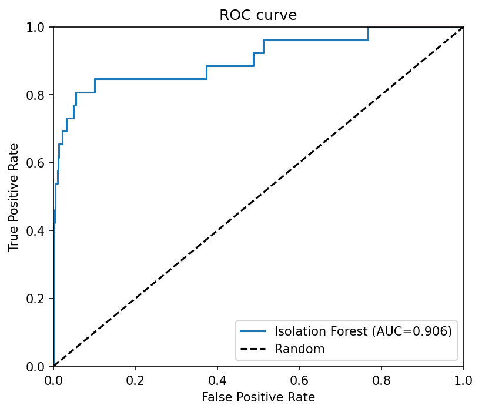
- Score distribution: 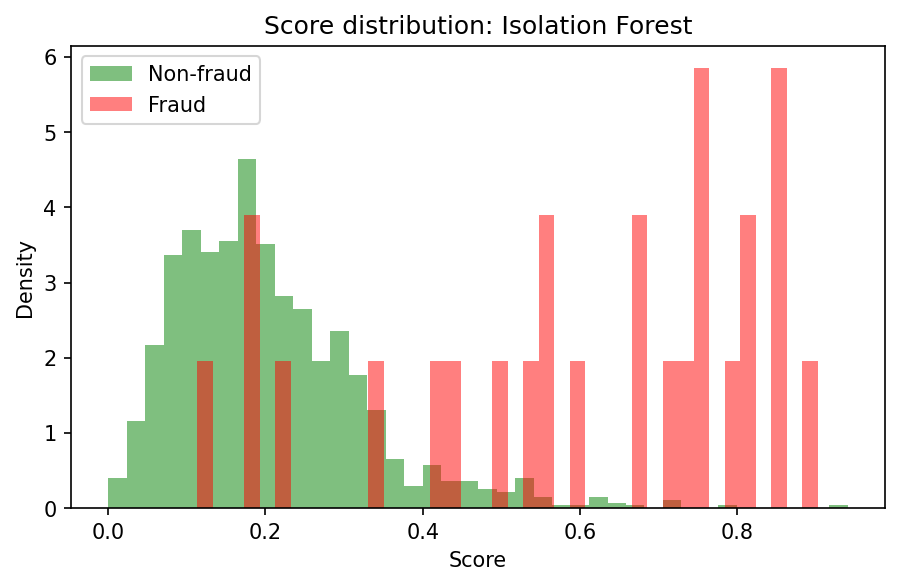
- Confusion matrix: 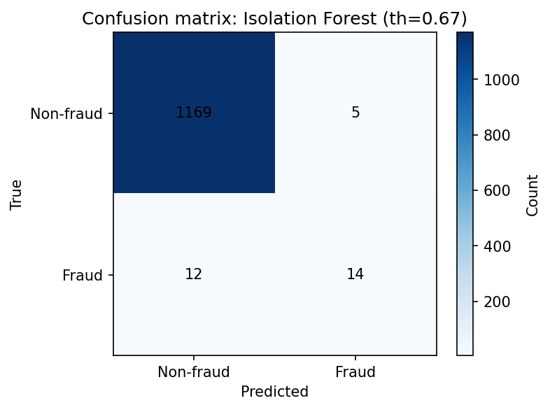
- Threshold vs P/R: 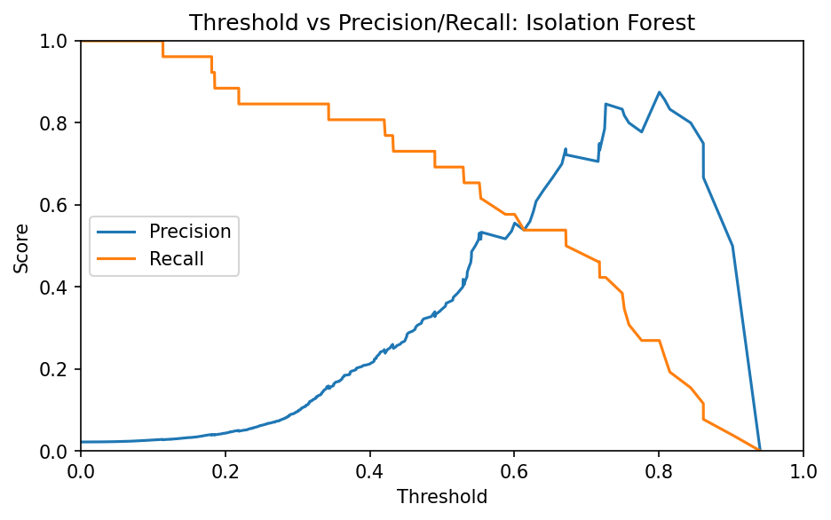

**Autoencoder:**
- PR curve: 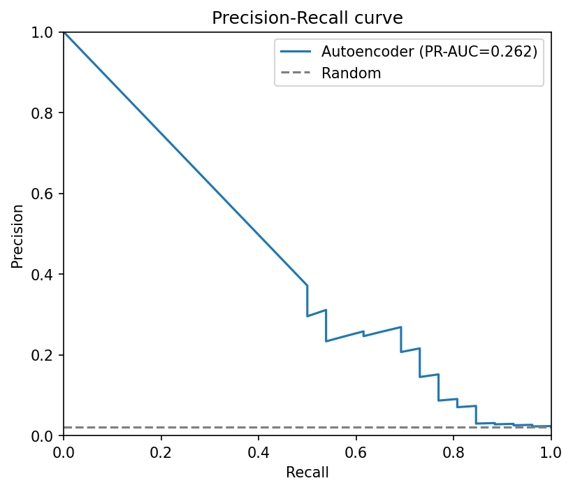
- ROC curve: 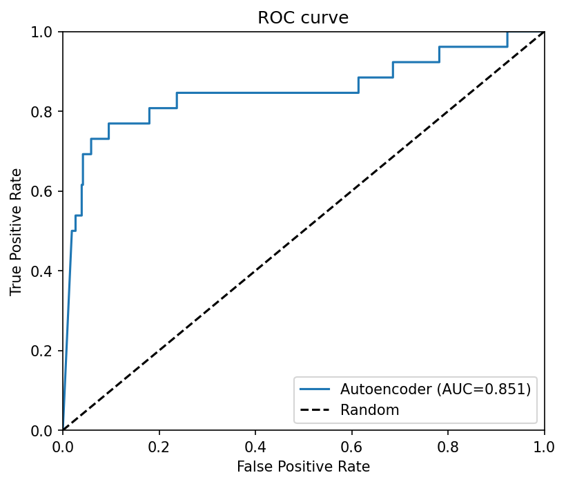
- Score distribution: 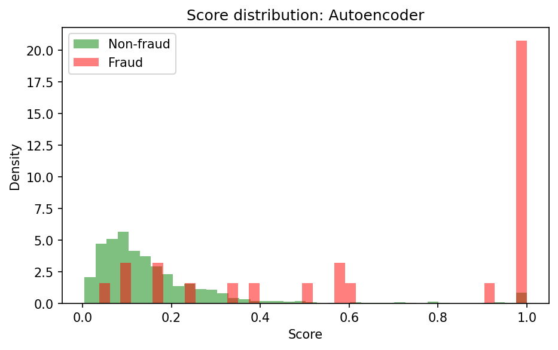
- Confusion matrix: 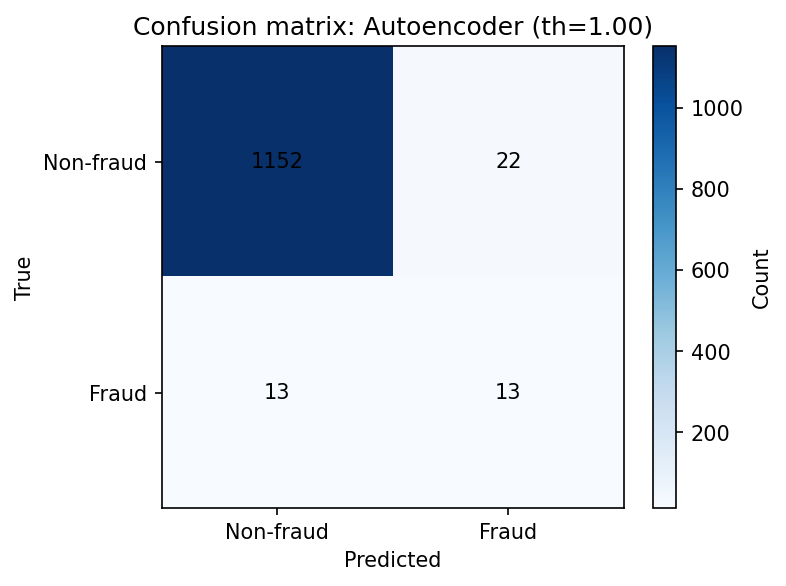
- Threshold vs P/R: 

**Ensemble:**
- PR curve: 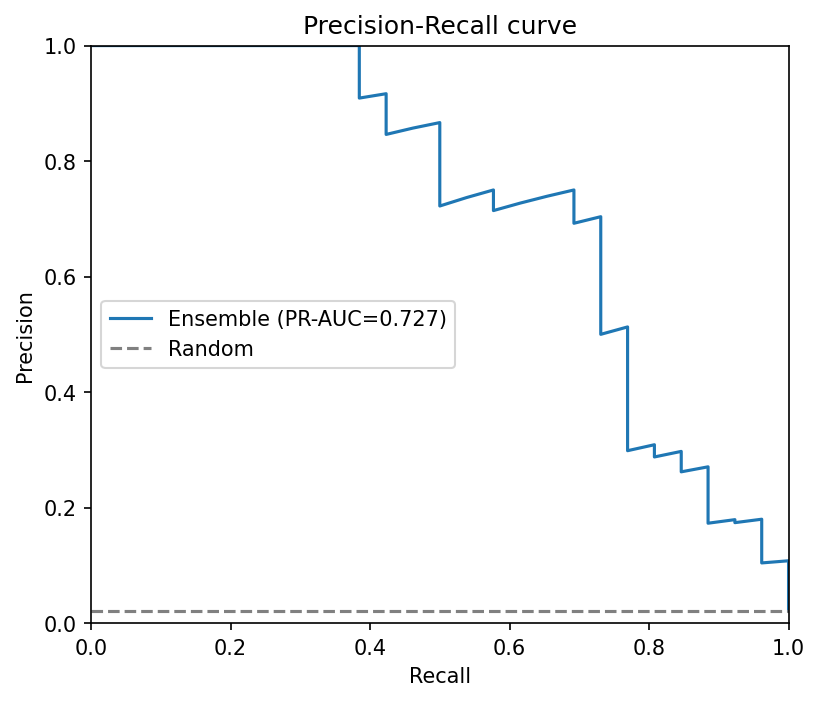
- ROC curve: 
- Score distribution: 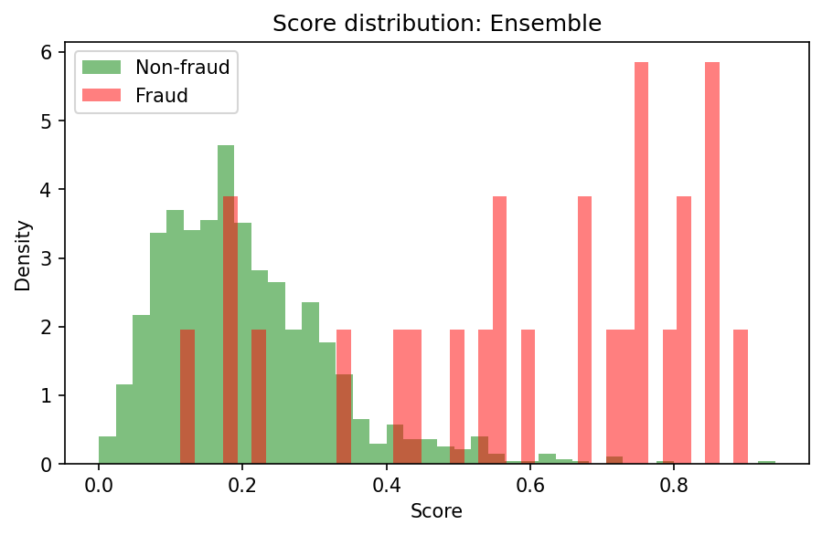
- Confusion matrix: 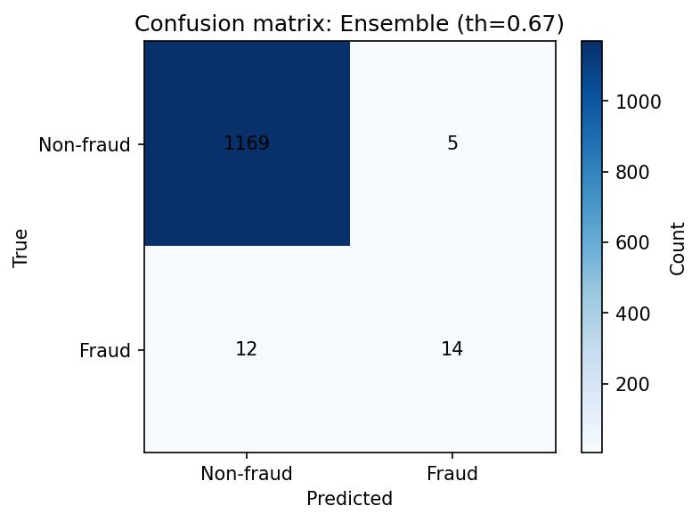
- Threshold vs P/R: 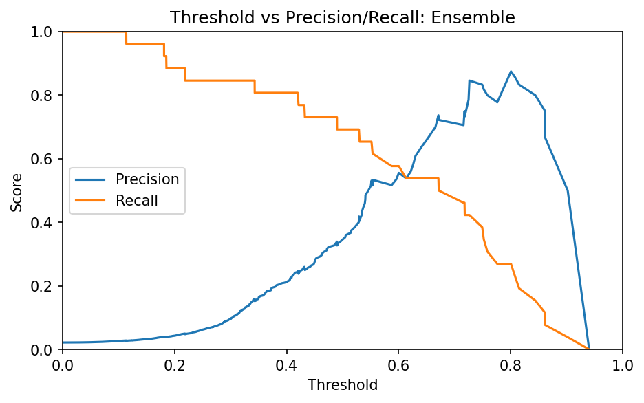
